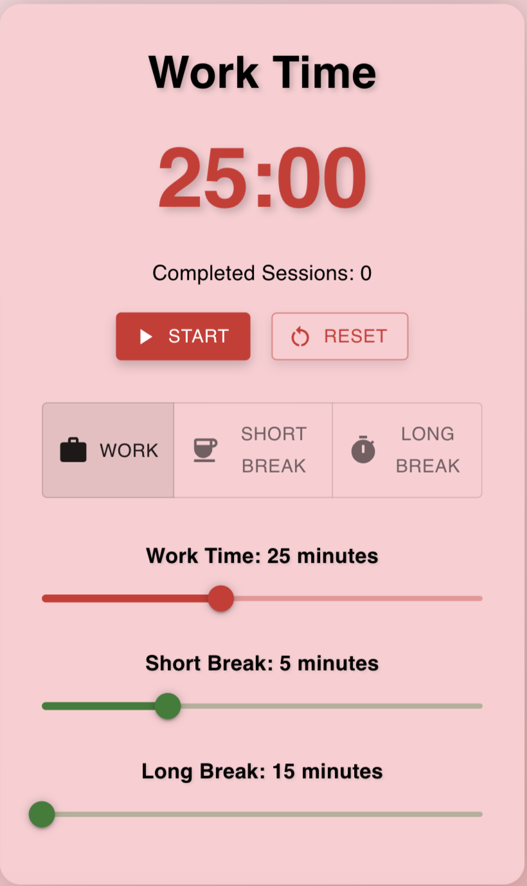
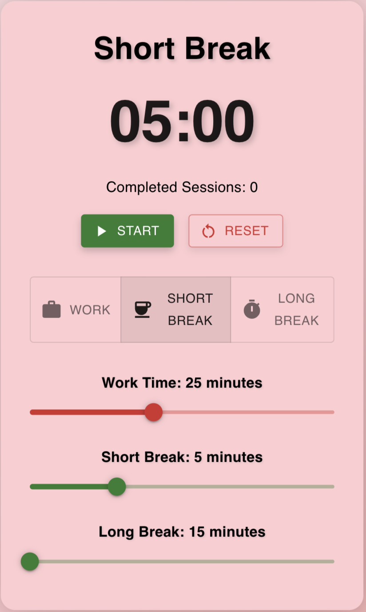
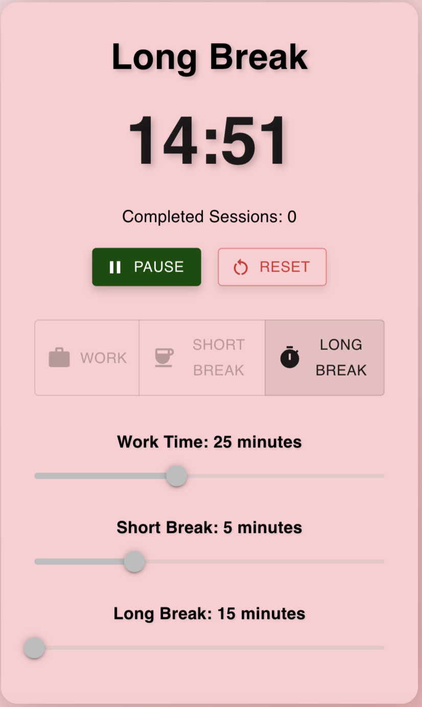

# Pomodoro Timer

A beautiful and functional Pomodoro Timer web application built with React, TypeScript, and Material-UI. Features a tomato-themed design with customizable work and break durations.

## Features

- 🍅 Tomato-themed design
- ⏱️ Customizable work and break durations
- 🔄 Auto-switching between work and break modes
- 📊 Session tracking
- 🎨 Beautiful Material-UI interface
- 🌙 Dark mode support

## Screenshots

### Work Mode


### Short Break Mode


### Long Break Mode


## Prerequisites

Before you begin, ensure you have the following installed:

- [Node.js](https://nodejs.org/) (version 14 or higher)
- [npm](https://www.npmjs.com/) (comes with Node.js)
- A modern web browser (Chrome, Firefox, Safari, or Edge)

## Installation

1. Clone the repository:
   ```bash
   git clone <repository-url>
   cd pomodoro-timer
   ```

2. Install dependencies:
   ```bash
   npm install
   ```

3. Start the development server:
   ```bash
   npm start
   ```

4. Open [http://localhost:3000](http://localhost:3000) in your browser to view the application.

## Available Scripts

In the project directory, you can run:

- `npm start` - Runs the app in development mode
- `npm test` - Launches the test runner
- `npm run build` - Builds the app for production
- `npm run eject` - Ejects from Create React App (Note: this is a one-way operation)

## Project Structure

```
pomodoro-timer/
├── assets/              # Images and screenshots
├── public/              # Static files
├── src/                 # Source files
│   ├── components/      # React components
│   │   └── PomodoroTimer.tsx  # Main timer component
│   ├── App.tsx          # Main application component
│   └── index.tsx        # Application entry point
├── package.json         # Project dependencies
└── tsconfig.json        # TypeScript configuration
```

## Technologies Used

- React 18
- TypeScript
- Material-UI
- Emotion (for styling)
- Create React App

## Contributing

1. Fork the repository
2. Create your feature branch (`git checkout -b feature/amazing-feature`)
3. Commit your changes (`git commit -m 'Add some amazing feature'`)
4. Push to the branch (`git push origin feature/amazing-feature`)
5. Open a Pull Request

## Acknowledgments

- Inspired by the Pomodoro Technique
- Built with Create React App
- Uses Material-UI for beautiful components
